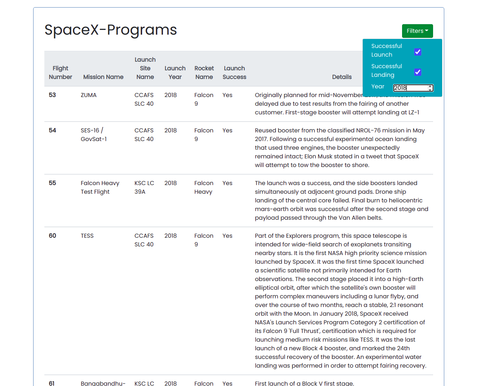
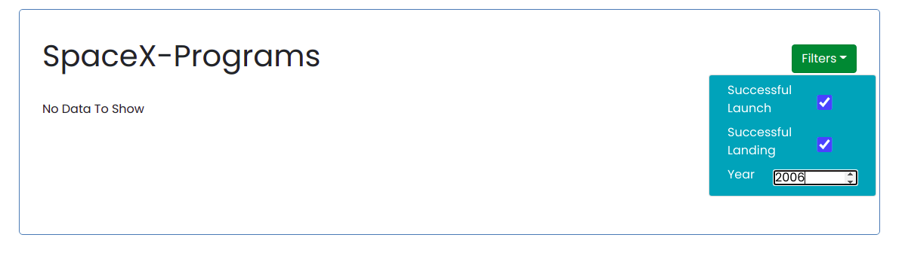

# SPACEX DATA
### This web app has been hosted over Heroku and you can find it over here <a href = "https://space-xinfo.herokuapp.com/"> ~Link </a> 

## ABOUT THE WEBAPP
This webapp has been built using REACT JS and displays all of the launches by SpaceX program from the following json data(<a href = "https://api.spacexdata.com/v3/launches?limit=100"> Data </a>).

It also contains the following filters which can be applied in order to filter the data -  
i) Successful Launch : This filters the data on the basis of successful launches    
ii) Successful Landing : This filters the data on the basis of successful landings    
iii) Year: Filter the data to see all the launches in a particular year  
Multiple filters can also be applied at a time.   
  
## APPROACH  
The information from the JSON data was fetched using the fetch() API of react. This data was then displayed on the client-side in tables with the help of useState Hooks of react.
The filtering of data was achieved by triggering function calls on choosing the respective filter options and adding key value pairs to the original url to display the desired data. Multiple filtering was achieved by adding key-value pairs over the previous url with some checks to prevent the creation of wrong URLs.

<b> ORIGINAL URL</b>  
(a) "https://api.spacexdata.com/v3/launches?limit=100"  
        - Will used to display all the launch details from mission number - 1 to 100

<b> EXAMPLES OF URL CHANGE ON APPLYING FILTER</b>   
(b) "https://api.spacexdata.com/v3/launches?limit=100&launch_success=true"  
        - Will be used to display all the successful launches  
     
(c) "https://api.spacexdata.com/v3/launches?limit=100land_success=true"  
        - Will be used to display all the successful landings  
      
(d) "https://api.spacexdata.com/v3/launches?limit=100&launch_year=2014"  
        - Will be used to display all the launches in the year 2004  
  
 
<b> EXAMPLES OF URL CHANGE ON MULTIPLE FILTERING</b>  
(e) "https://api.spacexdata.com/v3/launches?limit=100&launch_success=true&land_success=true"  
        - Will be used to display all the successful launches that landed successfully. 
        
(f) "https://api.spacexdata.com/v3/launches?limit=100&launch_success=true&land_success=true&launch_year=2014"  
        - Will be used to display all the successful launches that landed successfully in the year 2004  

  
## WEB-APP
<b>(i) Original display of webapp</b>
   

<b>(ii) Filter Options of Web app</b>  
    

<b>(iii) Using Single Filter</b>  

<b>(iv) Multiple Filters</b>  
  
  

## Features to be Added :   
~~(i) Rendering the page with applied filter on refreshing the page~~  
        Implemented this by saving the url in local storage and retrieving it everytime the page loads
  
